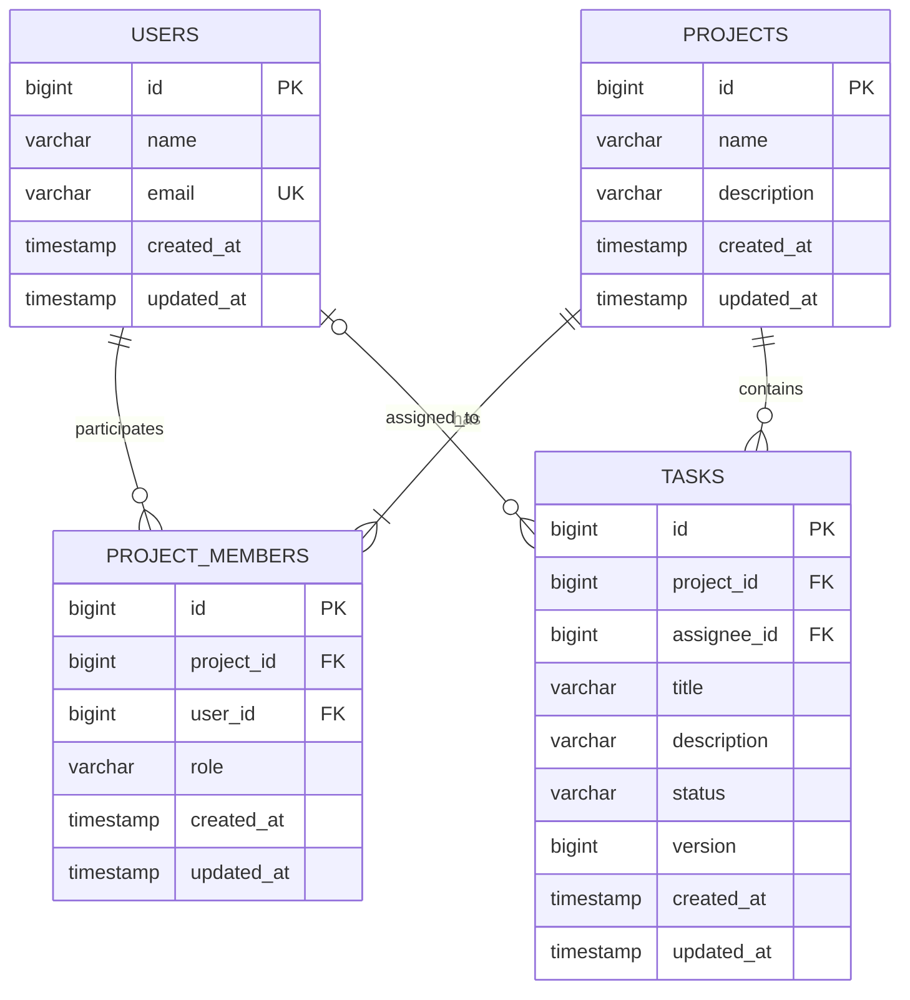

# Project Collab

사용자들이 프로젝트에 참여하고 역할에 따라 작업을 관리하는 백엔드 중심의 프로젝트 협업 서비스입니다.

프로젝트마다 사용자의 역할을 `OWNER`, `ADMIN`, `MEMBER`로 구분하고, 프로젝트 경계를 기준으로 접근 권한과 데이터 노출을 제한합니다. 동일한 작업을 여러 사용자가 수정할 때는 JPA 낙관적 락(`@Version`)으로 오래된 요청을 감지하여 `409 Conflict`를 반환합니다.

## 구현 범위

- 사용자 등록·조회
- 프로젝트 생성·조회·수정·삭제 및 내가 속한 프로젝트 목록 조회
- 프로젝트 멤버 추가·역할 변경·제거·목록 조회
- 역할과 작업 담당자에 따른 권한 처리
- 작업 생성·조회·수정·삭제
- 작업 제목·설명 검색, 상태 필터, 페이징
- 작업 동시 수정 충돌 감지
- 일관된 오류 응답
- OpenAPI 3 및 Swagger UI
- JUnit 5·MockMvc 통합 테스트

React 화면은 선택 항목이므로 구현하지 않고 백엔드 도메인 규칙, 권한, 데이터 격리와 동시성 검증에 집중했습니다.

## 기술 스택

| 구분 | 기술 | 선택 이유 |
| :-- | :-- | :-- |
| 언어 | Java 17 | 과제 필수 버전이며 장기 지원 버전입니다. |
| 프레임워크 | Spring Boot 3.3.13 | 웹, 검증, 트랜잭션과 테스트 구성을 일관되게 제공합니다. |
| API | Spring Web MVC | 현재 규모의 동기식 REST API에 적합합니다. |
| 영속성 | Spring Data JPA, Hibernate | 엔티티 관계, 트랜잭션과 `@Version` 낙관적 락을 명확하게 표현할 수 있습니다. |
| DB | H2 인메모리 | 외부 설치 없이 클론 직후 실행할 수 있습니다. PostgreSQL 호환 모드로 실행합니다. |
| 입력 검증 | Jakarta Bean Validation | DTO 선언부에서 필수값과 길이 제한을 일관되게 관리합니다. |
| API 문서 | Springdoc OpenAPI 2.6.0 | Controller 정보를 OpenAPI 3 문서와 Swagger UI로 자동 노출합니다. |
| 빌드 | Gradle Wrapper 8.10.2 | 로컬 Gradle 설치 없이 동일한 버전으로 빌드할 수 있습니다. |
| 테스트 | JUnit 5, Spring Boot Test, MockMvc | HTTP 요청부터 권한·JPA·오류 응답까지 통합하여 검증합니다. |

과제 규모에서는 JPQL 한 개로 검색 요구사항을 충분히 표현할 수 있어 QueryDSL을 추가하지 않았습니다. 또한 Redis, Kafka, Docker 등의 인프라는 현재 기능에 필요한 문제를 해결하지 않으므로 도입하지 않았습니다.

## 실행 방법

### 사전 조건

- JDK 17
- `JAVA_HOME`이 JDK 17을 가리키도록 설정

별도의 DB, Docker, API 키 또는 환경 변수는 필요하지 않습니다.

### 애플리케이션 실행

macOS/Linux:

```bash
./gradlew bootRun
```

Windows:

```powershell
.\gradlew.bat bootRun
```

다음 로그가 출력되면 실행이 완료된 것입니다.

```text
Tomcat started on port 8080
Started ProjectCollabApplication
```

### 접속 주소

| 용도 | 주소 |
| :-- | :-- |
| Swagger UI | <http://localhost:8080/swagger-ui/index.html> |
| Swagger 단축 경로 | <http://localhost:8080/swagger-ui.html> |
| OpenAPI JSON | <http://localhost:8080/v3/api-docs> |
| H2 Console | <http://localhost:8080/h2-console> |
| 상태 확인 | <http://localhost:8080/api/health> |

상태 API의 정상 응답은 다음과 같습니다.

```json
{
  "status": "UP",
  "application": "project-collab"
}
```

H2 Console 접속 정보:

| 항목 | 값 |
| :-- | :-- |
| Driver Class | `org.h2.Driver` |
| JDBC URL | `jdbc:h2:mem:projectcollab;MODE=PostgreSQL;DB_CLOSE_DELAY=-1;DB_CLOSE_ON_EXIT=FALSE` |
| User Name | `sa` |
| Password | 비워 둠 |

H2는 인메모리 데이터베이스이며 애플리케이션을 종료하면 데이터가 사라집니다. 기본값인 `jdbc:h2:mem:testdb`가 아니라 위의 전체 JDBC URL을 입력해야 합니다.

## 실행 직후 기능 확인

초기 데이터를 코드에 고정하지 않고 API를 통해 전체 생성 흐름을 확인하도록 구성했습니다. Swagger UI에서 다음 순서로 실행합니다.

1. `POST /api/users`를 두 번 호출하여 OWNER용 사용자와 MEMBER용 사용자를 생성합니다.
2. 첫 번째 사용자의 ID를 `X-Requester-Id`에 넣고 `POST /api/projects`를 호출합니다.
3. `GET /api/projects/{projectId}/members`로 생성자가 `OWNER`로 자동 등록됐는지 확인합니다.
4. `POST /api/projects/{projectId}/members`로 두 번째 사용자를 `MEMBER`로 추가합니다.
5. 두 번째 사용자의 ID를 `X-Requester-Id`에 넣고 `POST /api/projects/{projectId}/tasks`로 작업을 생성합니다.
6. `GET /api/projects/{projectId}/tasks`에서 검색·필터·페이징 결과를 확인합니다.
7. 작업 응답의 `version`을 포함하여 `PUT /api/projects/{projectId}/tasks/{taskId}`를 호출합니다.
8. 같은 이전 `version`으로 다시 수정하여 `409 TASK_VERSION_CONFLICT`가 반환되는지 확인합니다.

모든 입력값과 예상 응답을 포함한 전체 시나리오는 [Swagger API 실습 가이드](docs/Swagger_API_실습_가이드.md)에 정리했습니다.

## 요청자 식별 방식

인증은 과제 범위가 아니므로 인증 토큰 대신 다음 헤더로 현재 요청자를 전달합니다.

```http
X-Requester-Id: 1
```

`X-Requester-Id`는 조회 대상 사용자 ID가 아니라 **현재 요청을 수행하는 사용자 ID**입니다. 예를 들어 OWNER가 프로젝트 멤버 목록을 조회하면 요청자는 OWNER 한 명이지만, 응답에는 그 프로젝트에 속한 모든 멤버가 포함됩니다.

사용자 등록·조회와 상태 API를 제외한 프로젝트·멤버·작업 API에서 이 헤더가 필요합니다. 실제 서비스로 확장할 때는 사용자가 임의로 전달하는 ID를 신뢰하지 않고 Spring Security 인증 결과에서 요청자 ID를 가져와야 합니다.

## REST API 요약

### 사용자

| Method | Endpoint | 설명 | 정상 응답 |
| :-- | :-- | :-- | :-- |
| `POST` | `/api/users` | 사용자 등록 | `201 Created` |
| `GET` | `/api/users/{userId}` | 사용자 조회 | `200 OK` |

사용자 생성 요청:

```json
{
  "name": "이기문",
  "email": "owner@example.com"
}
```

이메일은 앞뒤 공백을 제거하고 소문자로 정규화하며 중복을 허용하지 않습니다.

### 프로젝트

| Method | Endpoint | 권한 | 설명 | 정상 응답 |
| :-- | :-- | :-- | :-- | :-- |
| `POST` | `/api/projects` | 등록된 사용자 | 프로젝트 생성, 생성자를 OWNER로 등록 | `201 Created` |
| `GET` | `/api/projects` | 등록된 사용자 | 내가 속한 프로젝트 목록 | `200 OK` |
| `GET` | `/api/projects/{projectId}` | 프로젝트 멤버 | 프로젝트 상세 조회 | `200 OK` |
| `PUT` | `/api/projects/{projectId}` | OWNER, ADMIN | 프로젝트 전체 수정 | `200 OK` |
| `DELETE` | `/api/projects/{projectId}` | OWNER | 프로젝트 삭제 | `204 No Content` |

프로젝트 생성·수정 요청:

```json
{
  "name": "협업 서비스 개발",
  "description": "React와 Spring Boot를 사용하는 채용 과제"
}
```

### 프로젝트 멤버

| Method | Endpoint | 권한 | 설명 | 정상 응답 |
| :-- | :-- | :-- | :-- | :-- |
| `GET` | `/api/projects/{projectId}/members` | 프로젝트 멤버 | 멤버 목록 조회 | `200 OK` |
| `POST` | `/api/projects/{projectId}/members` | OWNER, ADMIN | 멤버 추가 | `201 Created` |
| `PATCH` | `/api/projects/{projectId}/members/{userId}` | OWNER, ADMIN | 역할 변경 | `200 OK` |
| `DELETE` | `/api/projects/{projectId}/members/{userId}` | OWNER, ADMIN | 멤버 제거 | `204 No Content` |

멤버 추가 요청:

```json
{
  "userId": 2,
  "role": "MEMBER"
}
```

역할 변경 요청:

```json
{
  "role": "ADMIN"
}
```

### 작업

| Method | Endpoint | 권한 | 설명 | 정상 응답 |
| :-- | :-- | :-- | :-- | :-- |
| `POST` | `/api/projects/{projectId}/tasks` | 프로젝트 멤버 | 작업 생성 | `201 Created` |
| `GET` | `/api/projects/{projectId}/tasks` | 프로젝트 멤버 | 검색·필터·페이징 목록 | `200 OK` |
| `GET` | `/api/projects/{projectId}/tasks/{taskId}` | 프로젝트 멤버 | 작업 상세 조회 | `200 OK` |
| `PUT` | `/api/projects/{projectId}/tasks/{taskId}` | 담당자, OWNER, ADMIN | 작업 전체 수정 | `200 OK` |
| `DELETE` | `/api/projects/{projectId}/tasks/{taskId}` | 담당자, OWNER, ADMIN | 작업 삭제 | `204 No Content` |

작업 생성 요청:

```json
{
  "title": "REST API 구현",
  "description": "사용자, 프로젝트, 작업 API를 구현한다",
  "status": "TODO",
  "assigneeId": 2
}
```

`status`를 생략하면 `TODO`가 적용되며 `assigneeId`는 `null`일 수 있습니다. 담당자를 지정한다면 같은 프로젝트의 멤버여야 합니다.

작업 수정 요청에는 조회 응답에서 받은 `version`이 반드시 필요합니다.

```json
{
  "title": "REST API 구현 완료",
  "description": "구현과 테스트를 완료했다",
  "status": "DONE",
  "assigneeId": 2,
  "version": 0
}
```

작업 상태는 다음 세 가지입니다.

- `TODO`: 시작 전
- `IN_PROGRESS`: 진행 중
- `DONE`: 완료

### 작업 목록 파라미터

```http
GET /api/projects/1/tasks?keyword=API&status=TODO&page=0&size=20
```

| 파라미터 | 필수 | 기본값 | 설명 |
| :-- | :-- | :-- | :-- |
| `keyword` | 아니요 | 없음 | 제목과 설명에서 대소문자 구분 없이 부분 검색 |
| `status` | 아니요 | 없음 | `TODO`, `IN_PROGRESS`, `DONE` |
| `page` | 아니요 | `0` | 0부터 시작하는 페이지 번호 |
| `size` | 아니요 | `20` | 페이지 크기, 1~100 |

목록은 `createdAt DESC, id DESC`로 정렬하여 생성 시각이 같아도 순서가 안정적으로 유지됩니다.

페이징 응답 예시:

```json
{
  "content": [
    {
      "id": 1,
      "projectId": 1,
      "title": "REST API 구현",
      "description": "사용자, 프로젝트, 작업 API를 구현한다",
      "status": "TODO",
      "assigneeId": 2,
      "assigneeName": "김멤버",
      "version": 0,
      "createdAt": "2026-08-25T10:00:00",
      "updatedAt": "2026-08-25T10:00:00"
    }
  ],
  "page": 0,
  "size": 20,
  "totalElements": 1,
  "totalPages": 1,
  "first": true,
  "last": true,
  "hasNext": false,
  "hasPrevious": false
}
```

### 시스템

| Method | Endpoint | 설명 | 정상 응답 |
| :-- | :-- | :-- | :-- |
| `GET` | `/api/health` | 애플리케이션 상태 확인 | `200 OK` |

## 도메인 및 테이블 설계



`User`와 `Project`의 다대다 관계에는 역할이라는 추가 속성이 필요하므로 단순 연결 테이블이 아닌 `ProjectMember` 엔티티로 모델링했습니다. `(project_id, user_id)`에는 유일 제약을 두어 같은 사용자가 같은 프로젝트에 중복 가입하지 못하게 했습니다.

한 사용자는 여러 프로젝트에서 서로 다른 역할을 가질 수 있습니다. `Task`는 반드시 하나의 `Project`에 속하고 담당자는 선택 사항입니다. JPA 연관관계는 기본적으로 지연 로딩을 사용하고 API에는 엔티티를 직접 노출하지 않고 DTO만 반환합니다.

`createdAt`, `updatedAt`은 `BaseTimeEntity`에서 공통 관리합니다. 프로젝트를 삭제할 때는 작업과 멤버십을 먼저 명시적으로 삭제하여 생명주기와 삭제 순서를 서비스 코드에서 드러냈습니다.

## 권한과 데이터 격리

| 기능 | OWNER | ADMIN | MEMBER |
| :-- | :--: | :--: | :--: |
| 프로젝트 상세·내 프로젝트 목록 | O | O | O |
| 프로젝트 수정 | O | O | X |
| 프로젝트 삭제 | O | X | X |
| 멤버 목록 조회 | O | O | O |
| 멤버 추가·역할 변경·제거 | O | O | X |
| 작업 생성·조회·목록 | O | O | O |
| 작업 수정·삭제 | O | O | 담당자인 경우만 O |

권한 검사는 Controller가 아니라 Service 계층의 `ProjectAuthorizationService`에 모았습니다. HTTP 이외의 호출 경로가 추가되어도 같은 규칙을 재사용하고, 실제 데이터 변경과 동일한 트랜잭션 범위에서 권한을 확인하기 위해서입니다.

적용한 세부 정책:

- 프로젝트 생성자는 같은 트랜잭션에서 자동으로 `OWNER`가 됩니다.
- 비멤버는 프로젝트 상세, 멤버, 작업의 조회를 포함한 모든 접근이 `403 PROJECT_ACCESS_DENIED`로 거부됩니다.
- 작업 조회 쿼리는 항상 `taskId`와 `projectId`를 함께 사용합니다.
- 작업 목록 검색도 항상 `projectId` 조건을 포함하여 다른 프로젝트 데이터가 섞이지 않게 합니다.
- 프로젝트에는 최소 한 명의 OWNER가 남아야 하며 마지막 OWNER의 강등과 제거는 `409 LAST_OWNER_REQUIRED`로 거부합니다.
- 담당자는 같은 프로젝트의 멤버만 지정할 수 있습니다.
- 담당 중인 멤버를 제거하면 해당 프로젝트 작업의 담당자를 미할당으로 변경하고 작업 버전도 증가시킵니다.
- 비멤버 요청에는 프로젝트 존재를 감추는 `404` 대신 권한 부족을 일관되게 표현하는 `403`을 선택했습니다.

## 동시 수정 처리

Task에 JPA `@Version` 필드를 두고, 클라이언트가 작업을 수정할 때 자신이 조회했던 `version`을 함께 보내도록 설계했습니다.

두 사용자가 모두 `version=0`인 작업을 조회한 뒤 수정하면 개념적으로 다음 조건부 SQL이 실행됩니다.

```sql
UPDATE tasks
SET title = ?,
    status = ?,
    version = 1
WHERE id = ?
  AND version = 0;
```

먼저 반영된 요청은 행 한 개를 수정하고 버전을 1로 증가시킵니다. 뒤늦게 같은 `version=0`으로 수정한 요청은 조건에 맞는 행이 없어 실패합니다. Hibernate의 낙관적 락 예외를 다음 응답으로 변환합니다.

```json
{
  "code": "TASK_VERSION_CONFLICT",
  "message": "다른 사용자가 작업을 먼저 수정했습니다. 최신 내용을 다시 조회해 주세요.",
  "status": 409,
  "timestamp": "2026-08-25T10:00:00+09:00",
  "path": "/api/projects/1/tasks/1",
  "fieldErrors": {}
}
```

비관적 락으로 사용자의 화면 편집 시간 전체를 잠그는 것은 불가능하고, Task 편집은 충돌 빈도가 높지 않다고 판단해 낙관적 락을 선택했습니다. 서비스의 요청 버전 사전 검사로 명확한 오류를 제공하고, 실제 동시 요청은 Hibernate의 원자적인 버전 조건 UPDATE로 최종 방어합니다.

상세한 동작 원리는 [작업 동시성 문제 해결 방법](docs/작업_동시성_문제_해결_방법.md)에 정리했습니다.

## 오류 응답

모든 애플리케이션 오류는 `@RestControllerAdvice`에서 같은 형식으로 반환합니다.

```json
{
  "code": "VALIDATION_FAILED",
  "message": "요청값 검증에 실패했습니다.",
  "status": 400,
  "timestamp": "2026-08-25T10:00:00+09:00",
  "path": "/api/users",
  "fieldErrors": {
    "name": "이름은 필수입니다."
  }
}
```

주요 상태 코드:

| 상태 | 사용 예 |
| :-- | :-- |
| `400 Bad Request` | 입력 검증 실패, 잘못된 enum·페이징, 프로젝트 외부 담당자 지정 |
| `403 Forbidden` | 비멤버 접근, 역할 또는 담당자 권한 부족 |
| `404 Not Found` | 사용자·프로젝트·멤버·작업을 찾을 수 없음 |
| `409 Conflict` | 이메일·멤버 중복, 마지막 OWNER 보호, 작업 버전 충돌 |

## 패키지 구조

```text
src/main/java/io/e2d/projectcollab
├── common
│   ├── config       # OpenAPI 설정
│   ├── domain       # 생성·수정 시각 공통 엔티티
│   ├── exception    # 오류 코드와 전역 예외 처리
│   └── web          # 요청자 헤더와 상태 API
├── user             # 사용자 domain/controller/service/repository/dto
├── project          # 프로젝트·멤버·권한
└── task             # 작업·검색·페이징·동시성
```

기능별 패키지를 우선하고 각 기능 내부를 계층으로 나눴습니다. 관련 코드가 가까이 있어 도메인 단위로 변경 범위를 파악하기 쉽고, 공통 정책만 `common`에 둡니다.

## 테스트

macOS/Linux:

```bash
./gradlew test
```

Windows:

```powershell
.\gradlew.bat test
```

현재 테스트는 6개 테스트 클래스, 총 18개이며 다음을 검증합니다.

- 기본 사용자·프로젝트·멤버·작업 CRUD
- 입력값 검증, 이메일·멤버 중복, 공통 오류 형식
- 요청자 헤더 누락 처리와 Swagger 태그 순서
- 프로젝트 경계를 벗어난 작업 조회 차단
- 비멤버의 프로젝트·멤버·작업 접근 차단
- OWNER·ADMIN·MEMBER 권한 차이
- 작업 담당자 및 프로젝트 멤버 여부 검증
- 마지막 OWNER 강등·제거 방지
- 멤버 제거 시 담당자 해제와 작업 버전 증가
- 제목·설명 검색, 상태 필터, 프로젝트 데이터 격리
- 페이징 메타데이터, 최대 크기 검증, 안정적인 최신순 정렬
- 오래된 버전 요청의 `409 Conflict`
- 같은 버전의 실제 동시 요청 중 한 건만 성공하는지 검증

제출 전 `test --rerun-tasks`로 다시 실행한 결과는 다음과 같습니다.

```text
Test suites: 6
Tests:       18
Failures:    0
Errors:      0
Skipped:     0
BUILD SUCCESSFUL
```

또한 `gradlew bootRun`으로 서버를 실행한 뒤 상태 API, Swagger UI, OpenAPI JSON, H2 Console과 사용자→프로젝트→멤버→작업 전체 HTTP 흐름을 확인했습니다. 오래된 작업 버전 요청이 `409 TASK_VERSION_CONFLICT`를 반환하는 것도 확인했습니다.

## 주요 설계 결정

### DTO와 단방향 연관관계

엔티티를 API 응답으로 직접 노출하면 지연 로딩, 순환 참조와 내부 스키마 노출 문제가 생길 수 있어 요청·응답 DTO를 분리했습니다. 현재 기능에는 부모에서 모든 자식을 탐색하는 양방향 컬렉션이 필요하지 않아 `ManyToOne` 중심의 단방향 관계를 사용했습니다.

### 전체 수정과 부분 수정

프로젝트와 작업의 주요 속성 수정은 완전한 새 상태를 전달하는 `PUT`을 사용했습니다. 멤버 역할은 한 필드만 바꾸는 명령이므로 `PATCH`를 사용했습니다.

### 작업 상태와 담당자

작업 상태는 협업 서비스의 기본 흐름을 표현하는 `TODO`, `IN_PROGRESS`, `DONE`으로 제한했습니다. 담당자가 정해지지 않은 백로그 작업도 필요하다고 판단하여 담당자는 선택 값으로 설계했습니다.

### 검색 구현

검색 조건이 프로젝트, 키워드, 상태 세 가지로 작아 하나의 JPQL 쿼리로 구현했습니다. 목록과 전체 개수 쿼리를 분리해 페이징하고, 필요한 담당자만 fetch join하여 목록 응답에서 추가 조회를 줄였습니다.

### 초기 데이터 미포함

인메모리 DB에 고정 ID를 가진 데이터를 미리 넣으면 생성 API의 전체 흐름과 제약조건을 확인하기 어렵다고 판단했습니다. 대신 Swagger에서 사용자 두 명부터 직접 생성하는 재현 가능한 실습 문서를 제공합니다.

## 여러 회사가 함께 사용하는 경우의 데이터 분리

현재 모델의 격리 경계는 `Project`입니다. 여러 회사가 같은 서비스를 사용한다면 `Company(Tenant)`를 최상위 격리 경계로 추가하고 다음 순서로 변경하겠습니다.

1. `companies`와 `company_members` 테이블을 추가하여 사용자와 회사의 소속 관계를 표현합니다.
2. `projects`에 필수 `company_id`를 추가하고, 멤버와 담당자가 같은 회사에 속하는지 검증합니다.
3. `project_members`와 `tasks`에도 `company_id`를 포함하여 모든 주요 조회가 `company_id + project_id`를 조건으로 사용하게 합니다.
4. `(company_id, id)` 복합 유일키·외래키와 인덱스를 추가하여 애플리케이션 실수로 회사 간 참조가 만들어지는 것도 DB에서 차단합니다.
5. 요청의 회사 ID를 일반 헤더 값으로 신뢰하지 않고 인증 토큰의 claim과 서버의 `TenantContext`에서 가져옵니다.
6. Repository 공통 규약과 통합 테스트를 두어 모든 상세·목록·수정·삭제 쿼리에 회사 조건이 포함되는지 검증합니다.
7. 운영 DB가 PostgreSQL이라면 Row Level Security를 추가하여 애플리케이션 조건 누락에 대한 방어 계층을 하나 더 둡니다.

초기에는 운영 비용과 복잡도가 낮은 **공유 DB·공유 스키마 + `company_id`** 방식을 선택하겠습니다. 법적·보안상 물리적 분리가 필요하거나 특정 회사의 부하가 커지면 동일한 애플리케이션 모델을 유지하면서 회사별 스키마 또는 회사별 DB로 단계적으로 분리하겠습니다.

## 구현하지 않은 부분과 추가 개선 계획

과제의 필수 백엔드 범위는 구현했습니다. 다음 항목은 과제 범위에서 제외했거나 추가 시간이 있을 때 진행할 내용입니다.

- React 화면: 선택 항목이므로 구현하지 않았습니다.
- 인증·인가 프레임워크: 과제에서 인증을 제외했으므로 `X-Requester-Id`를 사용했습니다. 실제 서비스에서는 Spring Security와 JWT/OAuth2로 교체합니다.
- 운영 DB와 마이그레이션: 현재는 H2 `create-drop`입니다. 운영 환경에서는 PostgreSQL과 Flyway를 사용하고 Testcontainers로 DB 호환성을 검증합니다.
- 마지막 OWNER 규칙의 고경합 보강: 현재 서비스 규칙으로 강등·제거를 차단합니다. 역할 변경 요청이 매우 빈번한 운영 환경이라면 프로젝트 또는 OWNER 멤버 행에 비관적 락을 적용해 동시 역할 변경도 직렬화합니다.
- 관측성과 운영 기능: 구조화 로그, 메트릭, 감사 이력과 요청 추적 ID를 추가합니다.
- CI: GitHub Actions에서 JDK 17로 테스트와 빌드를 자동 검증합니다.
- E2E 화면: React 작업 목록과 권한별 동작을 API와 연결해 검증합니다.

## 추가 문서

- [Swagger API 실습 가이드](docs/Swagger_API_실습_가이드.md)
- [프로젝트 서비스 도메인 이해](docs/프로젝트_서비스_도메인_이해.md)
- [작업 동시성 문제 해결 방법](docs/작업_동시성_문제_해결_방법.md)
- [채용 과제 요구사항 분석](11thD_채용과제_요구사항_분석.md)
